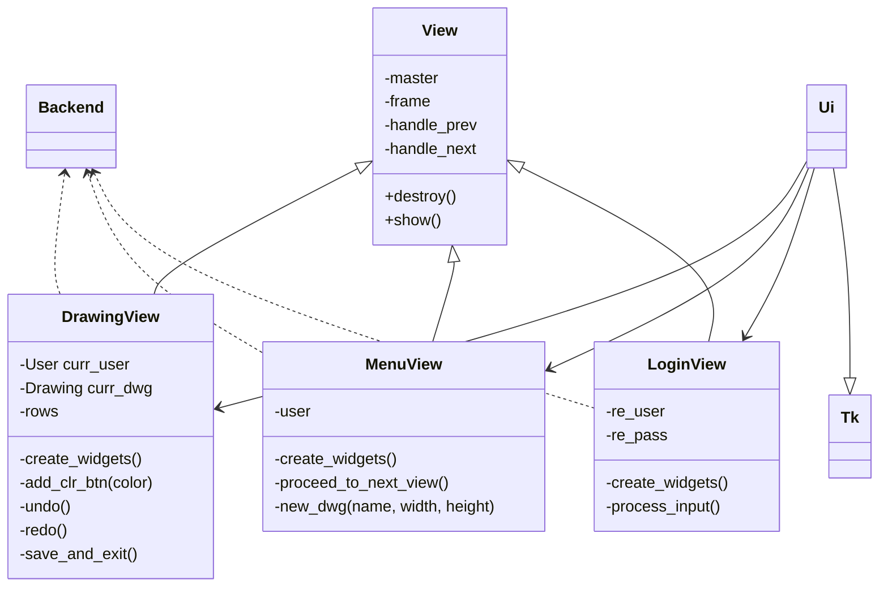

# Arkkitehtuurikuvaus

## Rakenne

```mermaid
classDiagram
    View <|-- LoginView
    View <|-- MenuView
    View <|-- DrawingView
    
    Ui --|> Tk
    Ui --> LoginView
    Ui --> MenuView
    Ui --> DrawingView
    
    Backend <.. LoginView
    Backend <.. MenuView
    Backend <.. DrawingView


class View {
    -master
    -frame
    -handle_prev
    -handle_next
    +destroy()
    +show()
}

class LoginView {
    -re_user
    -re_pass

    -create_widgets()
    -process_input()
}

class MenuView {
    -user

    -create_widgets()
    -proceed_to_next_view()
    -new_dwg(name, width, height)
}

class DrawingView {
    -User curr_user
    -Drawing curr_dwg
    -rows

    -create_widgets()
    -add_clr_btn(color)
    -undo()
    -redo()
    -save_and_exit()
}
```