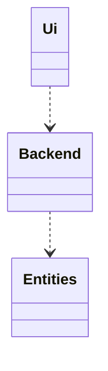
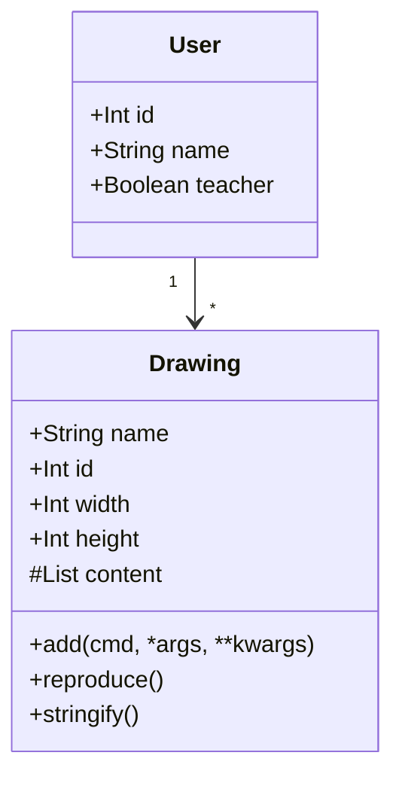
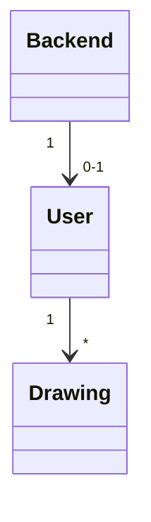
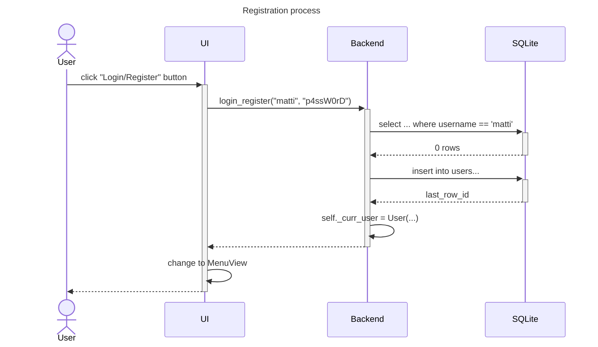
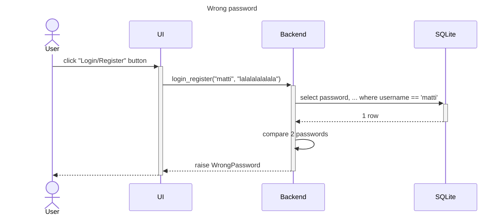
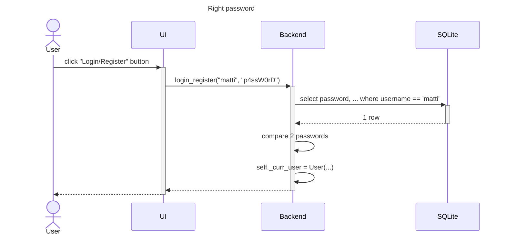

# Arkkitehtuurikuvaus

## Pakkausrakenne

Pakkaus `Ui` vastaa käyttäjän ja sovelluslogiikan vuorovaikutuksesta. `Backend` kuvaa sovelluslogiikkaa, on vastuullinen eri pakkauksien yhteistyöstä, sekä pysyväistalletuksesta. `Entities` sisältää käyttäjien ja piirrosten luokkia.

## Käyttöliittymä

On 3 päänäkymää, ja 2 ponnahdusikkuna:
- Kirjautumisnäkymä
- Menu näkymä
    - Uuden piirroksen tietojen näkymä
- Piirtonäkymä
    - Tekstin syötöikkuna

Näissä 3 päänäkymässä on yhteiset piirteet joita siirsin `View` luokkaan. Ne myös käyttävät saman ikkunan, joten kerralla vain 1 voi olla aktiivinen ja `Ui` luokka on vastuussa niitten vaihdosta. 

Login näkymä on yksinkertaistettu, ei ole erillistä näkymää rekisteröinnin varten, vaan uusia käyttäjiä luodaan suoraan annetulla `user:pass` kombolla.

Menu näkymässä käyttäjä saa valita omista piirroksistaan tai luoda uutta.
Näkymä myös heittää ponnahdusikkunan johon syötetään uusien piirrosten nimi, leveys ja korkeus.

Piirtonäkymässä yritin matkia kunnon vanha `MS Pain`t; käyttäjä voi säätää laukevien komentojen välillä:

- suorakaide
- oval
- viiva
- teksti
    - pyytää syötteen käyttäjältä

Eka 3 komento pystyy värejäkin käsitellä, joita myös napeilla pystyy valita.

## Sovelluslogiikka

Sovelluksessa 1 [Käyttäjä](../src/entities/user.py) saa omistaa monta [Piirrosta](../src/entities/drawing.py):

Yritin eristää [Backend](../src/backend/backend.py) luokkaan sovelluksen niitä toimintoja joita en ois pystynyt järkevästi toteuttaa omissa pakkauksissaan.

Luokan ainoa olio hoitaa esim:
- kirjautumisen/rekisteröinnin
- kuvan tallentamisen, listaamisen, modaamisen

## Pysyväistalletus

_Backend_ hallitsee tietokantaa taustalla, jossa 4 taulua:

- users
- drawings

- teachers
- templates

2 jälkimmäistä on jatkokehitystä miettien jo luotu valmiiksi. `CREATE TABLE IF NOT EXISTS` lauseiden ansiosta tietokantaa ei tarvitse erikseen rakentaa. Python:in kokonaisluvut tallennan `INTEGER`, Stringit `TEXT` muodossa. 
Olisi mennyt hirvee määrä resurssi keksiä ja normalisoida kaiken tarvitun taulun, joten piirrosten sisällön tallennus on varsin epätehokasta, JSON muodossa `TEXT`:ina. SQLite kuitenkin tukee myös json scalar funktioita, joten on myös mahdollista laajentaa sovellusta tässä muodossakin.
Tarkempaa tiedot kannan rakenteesta löydät Backend luokan [create_scheme](../src/backend/backend.py) methodista.

## Päätoiminnallisuudet

### Yhdistetty login/register toiminta

Jos käyttäjä ei ole olemassa, sitä rekisteröidään, pääsy seuraavaan näkymään tapahtuu heti.

Alla "Wrong password" kaaviossa näkyy miten olemassa olevan käyttäjän autentikointi tapahtuu.

