# Arkkitehtuurikuvaus

## Pakkausrakenne

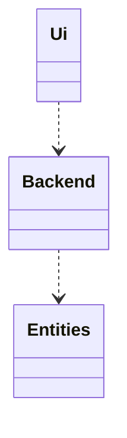

Pakkaus `Ui` vastaa käyttäjän ja sovelluslogiikan vuorovaikutuksesta. `Backend` kuvaa sovelluslogiikkaa, on vastuullinen eri pakkauksien yhteistyöstä, sekä pysyväistalletuksesta. `Entities` sisältää käyttäjien ja piirrosten luokkia.

## Käyttöliittymä

On 3 päänäkymää, ja 3 ponnahdusikkuna:
- [Kirjautumisnäkymä](/src/ui/login_view.py)
    - Uuden käyttäjän rekisteröinnissä pyydetään salasanaa uudelleen
- [Menu näkymä](/src/ui/menu_view.py)
    - Uuden piirroksen tietojen näkymä
- [Piirtonäkymä](/src/ui/drawing_view.py)
    - Tekstin syöttöikkuna

Näissä 3 päänäkymässä on yhteiset piirteet joita siirsin [View](/src/ui/common.py) luokkaan. Ne myös käyttävät saman ikkunan, joten kerralla vain 1 voi olla aktiivinen ja `Ui` luokka on vastuussa niitten vaihdosta. 

Login näkymä on yksinkertaistettu, ei ole erillistä näkymää rekisteröintiä varten, vaan uusia käyttäjiä luodaan suoraan annetulla `username`:`password` kombolla vahvistuksen jälkeen.

Menu näkymässä käyttäjä saa valita omista piirroksistaan tai luoda uutta, jonka tapauksessa näkymä heittää ponnahdusikkunan johon syötetään uusien piirrosten nimi, leveys ja korkeus.

Piirtonäkymässä yritin matkia kunnon vanha `MS Pain`t; käyttäjä voi säätää laukevien komentojen välillä:

- suorakaide
- oval
- viiva
- teksti

## Sovelluslogiikka

Sovelluksessa 1 [Käyttäjä](/src/entities/user.py) saa omistaa monta [Piirrosta](/src/entities/drawing.py):

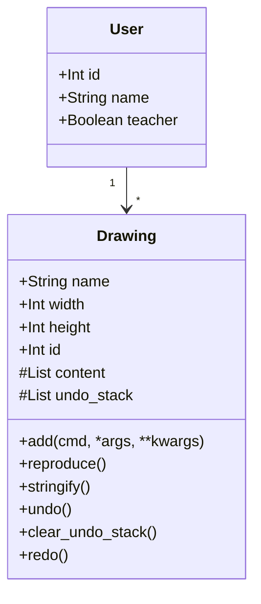

Yritin eristää [DrawingManager](/src/backend/dwg_mgmt.py) luokkaan sovelluksen niitä toimintoja jotkut vaikuttaa piirroksiin, myös [UserManager](/src/backend/user_mgmt.py) luokkaan ne toiminnot, jotkut liittyvät tiukasti autentikaatioon. Molemmat moduulit exportoivat 1-1 oliota itsestään, jotkut hoitavat:
- kirjautumisen/rekisteröinnin
- kuvan tallentamisen, listaamisen, modaamisen

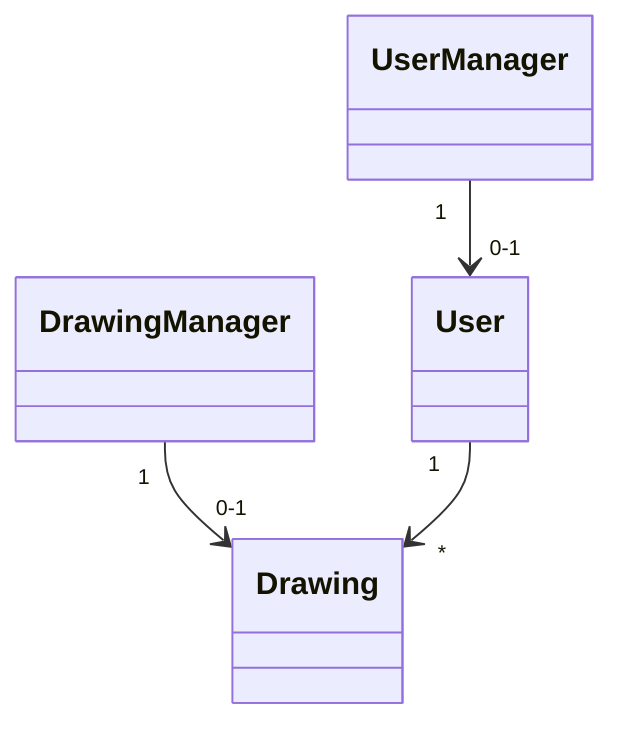

## Pysyväistalletus

Taustalla SQLite3 hoitaa pysyväistalletusta [conn](/src/backend/database.py) olion kautta, kannassa 4 taulua:

- users
- drawings

- teachers
- templates

2 jälkimmäistä on jatkokehitystä miettien jo luotu valmiiksi. `CREATE TABLE IF NOT EXISTS` lauseiden ansiosta tietokantaa ei tarvitse erikseen rakentaa/alustaa. Python:in kokonaisluvut tallennan `INTEGER`, Stringit `TEXT` muodossa. 
Resurssieni rajoitteista päädyin tallentaa piirrosten sisällön varsin epätehokkaasti, JSON muodossa `TEXT`:ina. SQLite kuitenkin tukee myös JSON scalar funktioita, joten on myös mahdollista laajentaa sovellusta tässä muodossakin!
Tarkemmat tiedot löytyvät yllä moduulin `executescript` kutsusta.

### Tiedosto sijainti

Tietokantaa perustetaan juurihakemiston `backend.db` tiedostoon.

## Päätoiminnallisuudet

### Yhdistetty login/register toiminta

Jos käyttäjä ei ole olemassa, sitä rekisteröidään, pääsy seuraavaan näkymään tapahtuu heti.

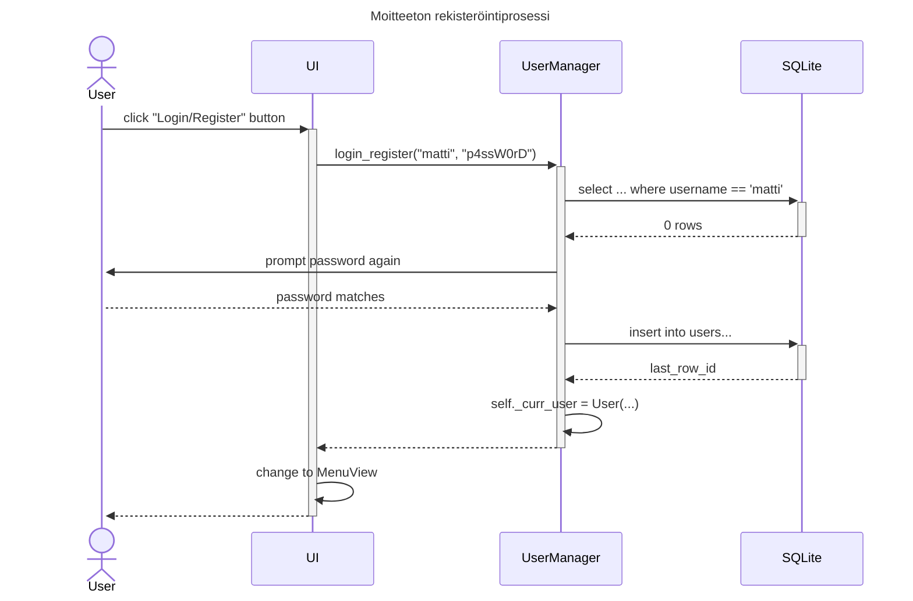

Alla kaaviossa yksi esimerkki miten `UserManager` estää pääsyn ilman oikeeta salasanaa. Tosiaan `WrongPassword` poikkeausta heitetään myös kun rekisteöinnissä pyydetään vahvistamaan käyttäjän sen salasanan, eikä se täsmää ekaa syötettä.

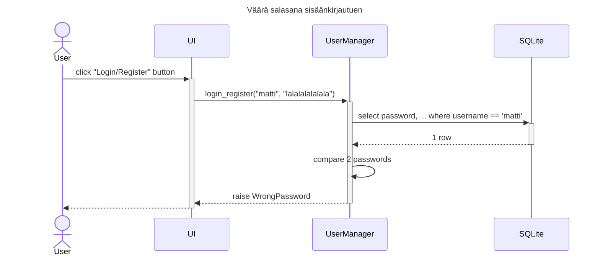

### Piirrosten valinta ja lataus

Menu näkymän tarkoitus on listata käyttäjän luomat piirrokset, uuden piirroksen luomisen mahdollistaminen, myös nappien avulla luoda yksiselittäistä tapaa päästä näkymien välissä eteenpäin (piirtämään) ja taksepääin (kirjautumalla ulos).

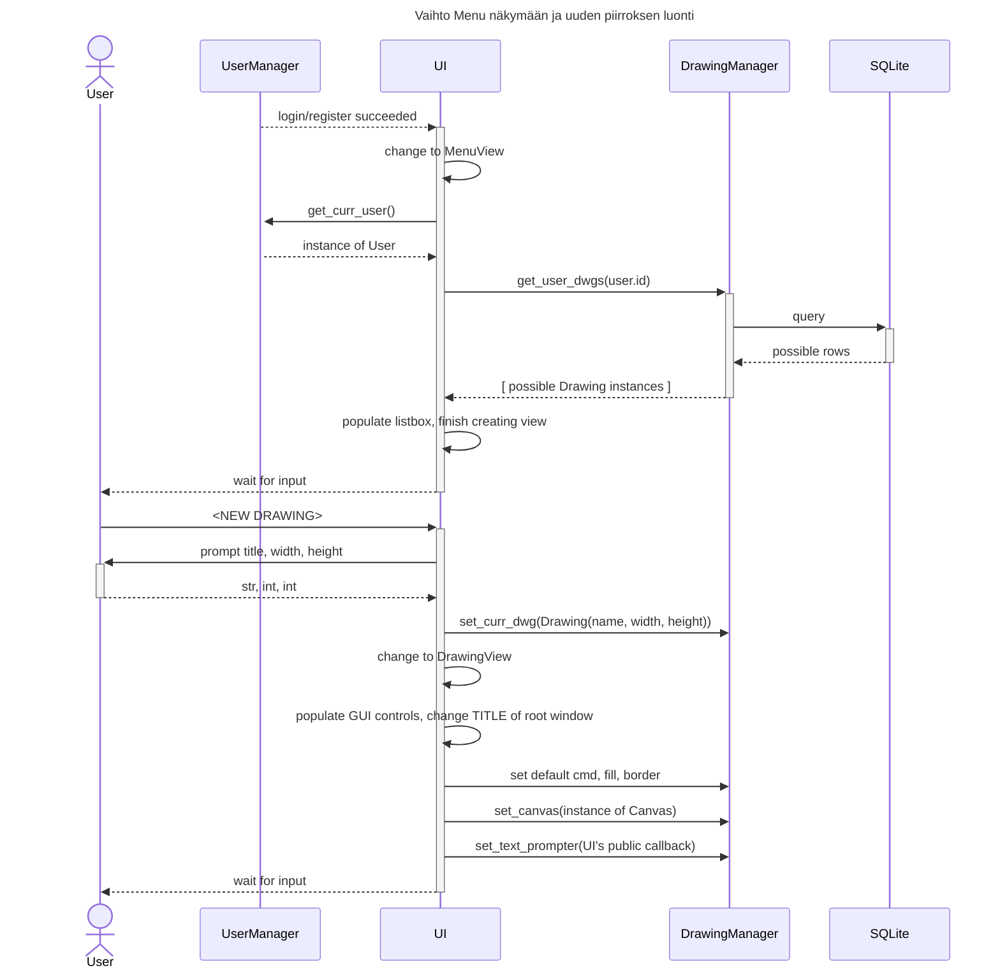

Yllä esitetty miten luodaan uuden piirroksen ja siirrytään piirtonäkymään kun piirros on tyhjä. Alla jatketaan siitä kohtaa, että kutsutaan `dwg_mgr.set_curr_dwg( ... )` ja käydään läpi miten olemassa olevat piirteet päätyvät täsmälleen samalla tavalla `tkinter.Canvas`:iin, kuten piirtämisen hetkellä ne olivat.

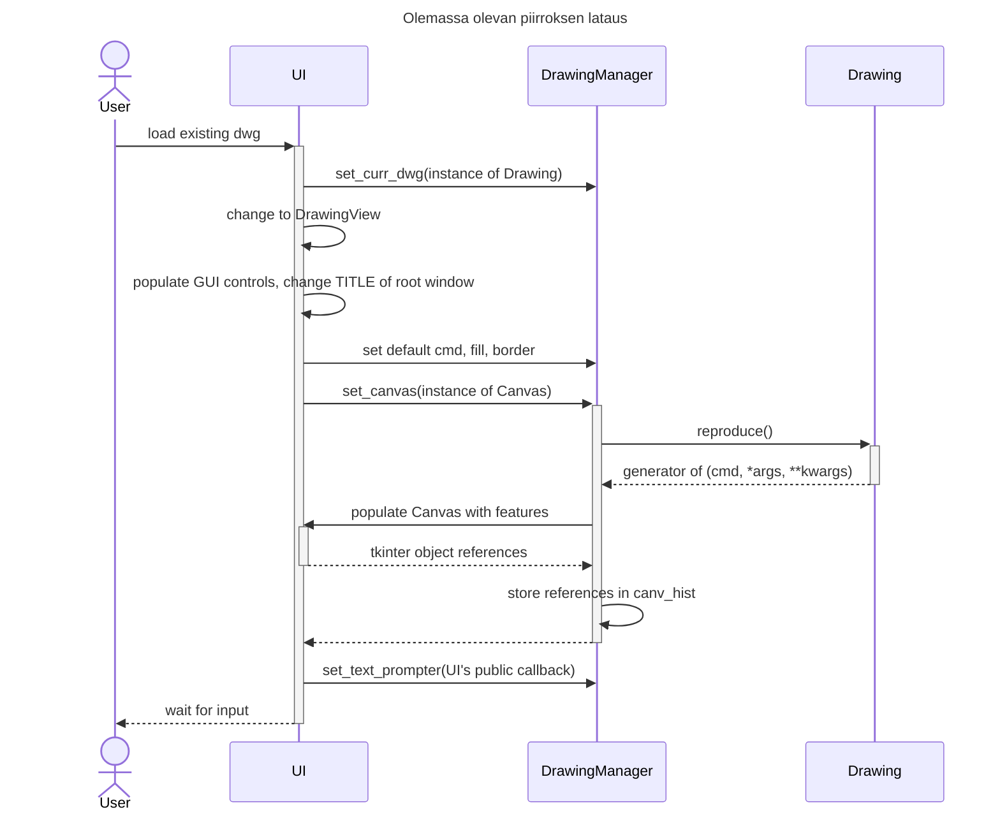

### Piirteiden lisääminen piirroksiin

Yllä saatiin `Drawing.reproduce()` kutsuen 1 piirre kerralla, joita luotiin Canvas:iin uudelleen kuvan ladattaessa. Tässä seuraavassa kaaviossa lisätään pari piirrettä:
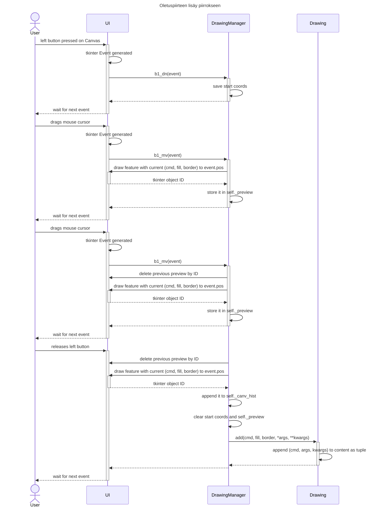

Tässä vaiheessa käyttäjä on lisännyt ruutuun pienehkon (meillä oli vain 2 hiiren-raahaus tapahtumaa) __suorakaiteen__,  __punaisella__ reunalla ja __vihreällä__ täytteellä (oletuksean). Aktiivinen `Piirros` olio myös laittoi `b1_up` tapahtuman yhteydessä talteen oleelliset tiedot pirteestä. __Viivan__ lisääminen poikkeaa sen verran yllä kuvatulta, että sillä ei ole määritelty väri reunalle, joten tuo puuttuu `kwargs`:sta. __Tekstin__ lisääminen poikkeaa yhä enemmän lopulta 3 piirteeltä alla tavalla:

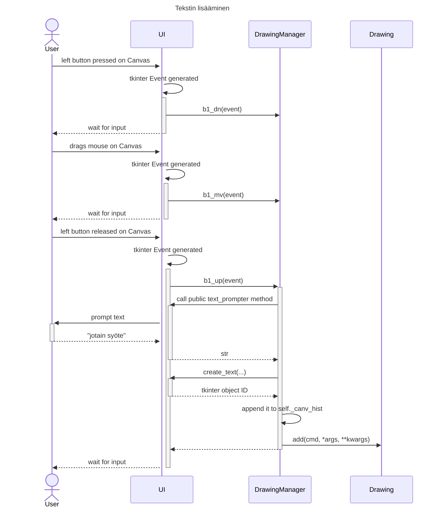

Tekstin lisääminen oli hankalin, koska `DrawingManager`:in piti pystyä pyytää syötteen käyttäjältä siten, että *codebase* olisi edelleen eristettynä

### Piirteiden/värien valinta

Alla kuvatulla tavalla käyttäjä pääsee valitsemaan missä vaiheessa tahansa tulevien piirteiden lajin __ovaaliksi__, jolla __keltainen__ reuna ja __sininen__ täyte.

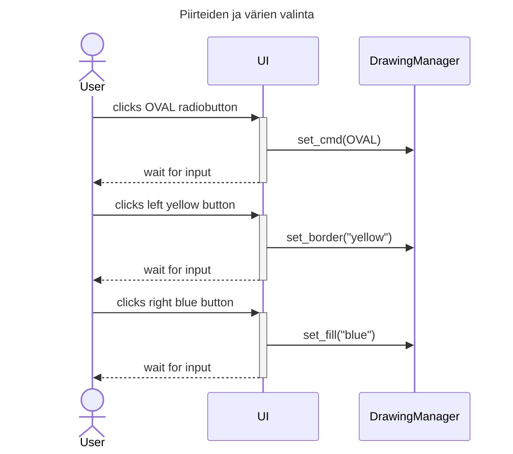

### Un-/redo toiminta

Käyttäjällä on mahdollisuus perua ja palauttaa peruutut pirteet piirrokseen. Alla tapauksessa oletetaan, että piirrokseen on lisätty tasan 2 piirrettä.

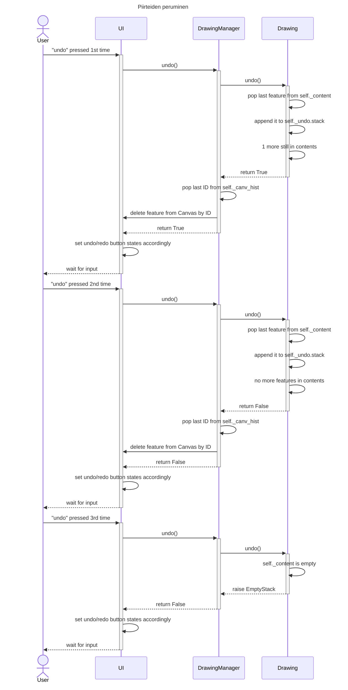

`Redo` toimii samalla periaatella, paitsi se `Drawing.redo()` palauttaa boolean arvon lisäksi palautettavaa piirettäkin, jotta DrawingManager pystyisi sitä lisätä uudelleen Canvas:iin.

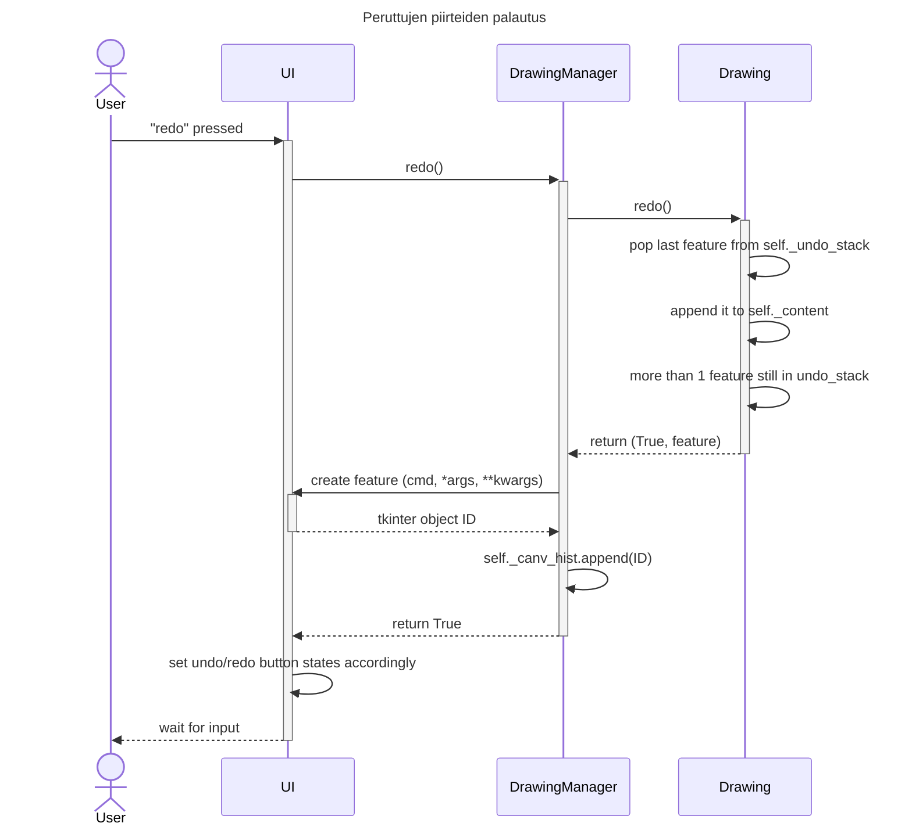

### Piirroksen tallentaminen

Loppujen lopuksi käyttäjä tallentaa piiroksensa, joka on joko ollut jo olemassa, tai on vasta luotu. Alla kaaviossa katsotaan uudne teoksen talletusta, tosiaan ero suurimmiltaan on `INSERT` vs `UPDATE` lause tietokantaan.
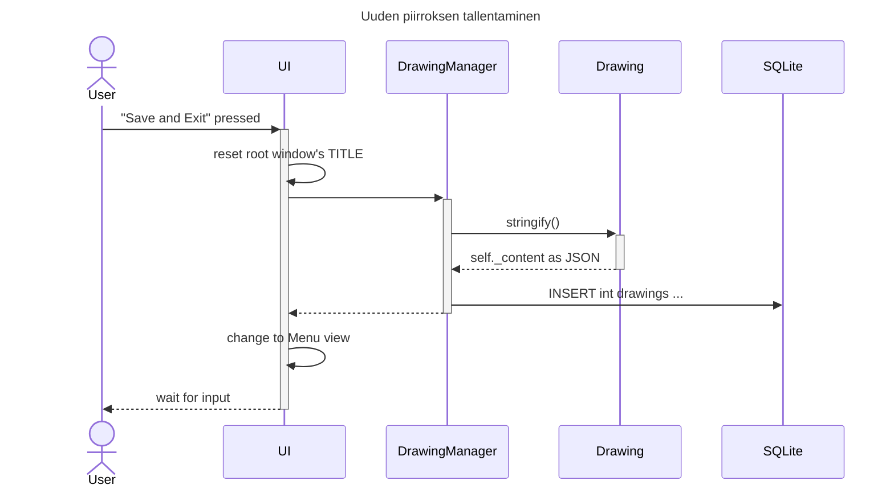
