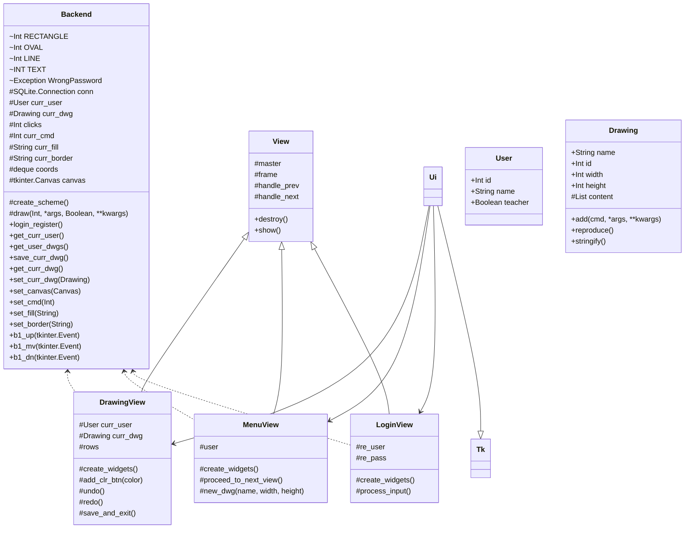

# Arkkitehtuurikuvaus

## Rakenne

```mermaid
classDiagram
    View <|-- LoginView
    View <|-- MenuView
    View <|-- DrawingView
    
    Ui --|> Tk
    Ui --> LoginView
    Ui --> MenuView
    Ui --> DrawingView
    
    Backend <.. LoginView
    Backend <.. MenuView
    Backend <.. DrawingView

class User {
    +Int id
    +String name
    +Boolean teacher
}

class Drawing {
    +String name
    +Int id
    +Int width
    +Int height
    #List content

    +add(cmd, *args, **kwargs)
    +reproduce()
    +stringify()
}

class Backend {
    ~Int RECTANGLE
    ~Int OVAL
    ~Int LINE
    ~INT TEXT
    ~Exception WrongPassword

    #SQLite.Connection conn
    #User curr_user
    #Drawing curr_dwg
    #Int clicks
    #Int curr_cmd
    #String curr_fill
    #String curr_border
    #deque coords
    #tkinter.Canvas canvas

    #create_scheme()
    #draw(Int, *args, Boolean, **kwargs)
    
    +login_register()
    +get_curr_user()
    +get_user_dwgs()
    +save_curr_dwg()
    +get_curr_dwg()
    +set_curr_dwg(Drawing)
    +set_canvas(Canvas)
    +set_cmd(Int)
    +set_fill(String)
    +set_border(String)
    +b1_up(tkinter.Event)
    +b1_mv(tkinter.Event)
    +b1_dn(tkinter.Event)
    

}


class View {
    #master
    #frame
    #handle_prev
    #handle_next
    +destroy()
    +show()
}

class LoginView {
    #re_user
    #re_pass

    #create_widgets()
    #process_input()
}

class MenuView {
    #user

    #create_widgets()
    #proceed_to_next_view()
    #new_dwg(name, width, height)
}

class DrawingView {
    #User curr_user
    #Drawing curr_dwg
    #rows

    #create_widgets()
    #add_clr_btn(color)
    #undo()
    #redo()
    #save_and_exit()
}
```