# Käyttöohje

Alla pikasesti kasattu step-by-step ohje, nauti!

## Rekisteröi

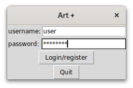

Tulee ponnahdusikkunassa varoitus, että kyseessä uusi käyttäjä, vahvista antamasi salasana.

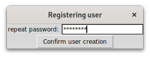

## Valitse jatkettava/luotava piirros

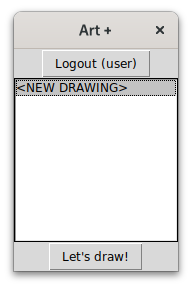

Tässä vaiheessa sulla ei ole mitään piirrosta, joten luo uusi!

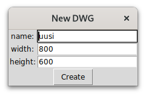

## Lisää piirteitä

Hiiren vasemman napin käyttäen pääset lisäämään suorakaiteita, ovaaleja, viivoja ja tekstejä. Oletuksena __suorakaide__ __punaisella__ reunalla ja __vihreällä__ täytteellä:

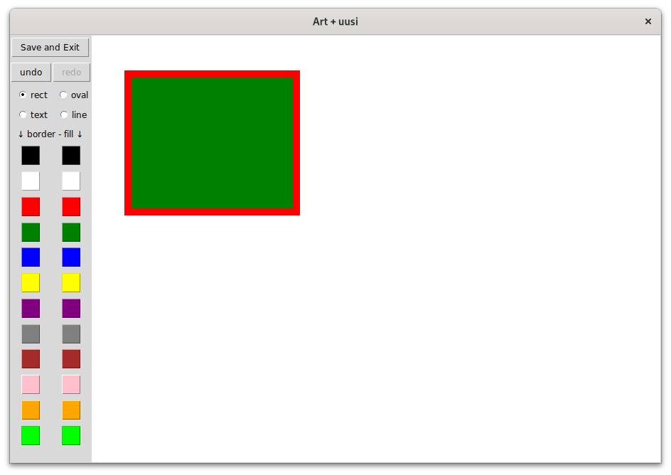

Vaihda __ovaaliin__, muunna myös väret!

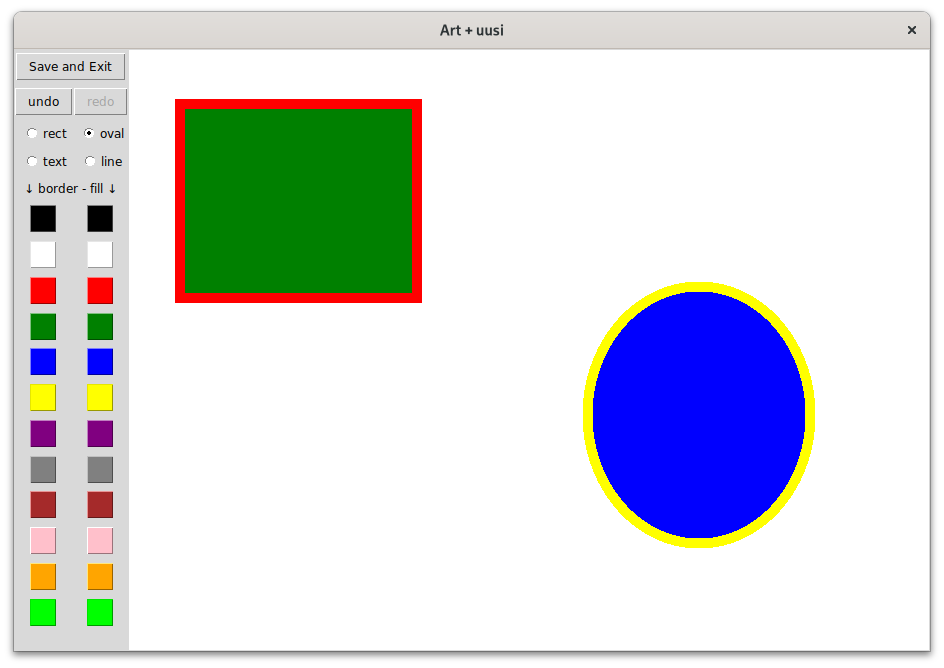

Viiva uudella värellä:

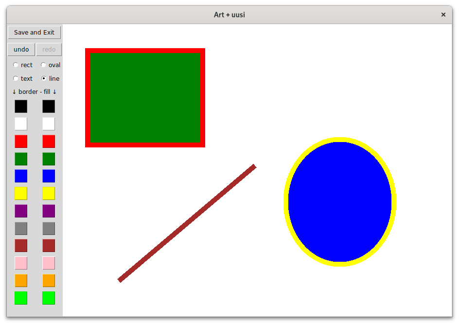

Ja loppujen lopuksi lisää `jotain hauskaa` tekstiä teokseesi

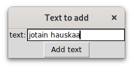

Avantgarde kuva valmiina!

## Tallentaminen

Klikkaa `Save and Exit` napista, näkymä vaihtuu ja piirroksesi löytyy nimen perusteella.

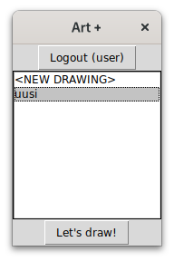

Käyttäjän vaihtamiseen paina `Logout` nappi

## Copyright for the win!

Toinen käyttäjä ei pääse käsiksi siun teokseen!

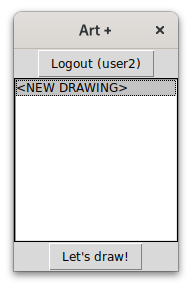

## Sammuttaminen

Paina `Quit` napista kun kyllästyttää!

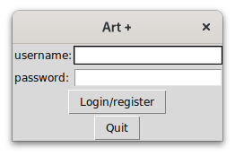
