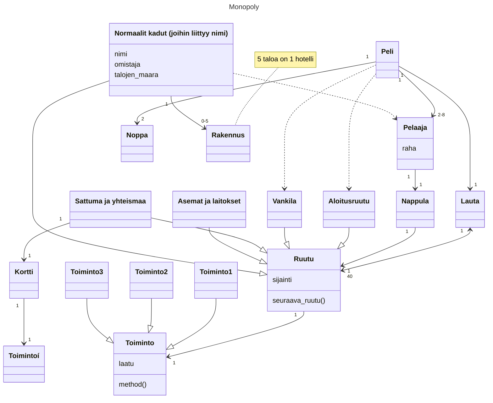

```mermaid
---
title: Monopoly
---
classDiagram
    Peli "1" --> "2-8" Pelaaja
    Peli "1" --> "2" Noppa
    Peli "1" --> "1" Lauta
    Lauta "1" <--> "40" Ruutu
    Pelaaja "1" --> "1" Nappula
    Nappula "1" --> "1" Ruutu
    Ruutu "1" --> "1" Toiminto
    class Ruutu {
        seuraava_ruutu()
        sijainti
    }
    class Toiminto {
        laatu
        method()
    }
    class Pelaaja {
        raha
    }
    
    Aloitusruutu --|> Ruutu
    Vankila --|> Ruutu
    id1 --|> Ruutu
    id2 --|> Ruutu
    id3 --|> Ruutu
    
    class id1["Sattuma ja yhteismaa"]
    class id2["Asemat ja laitokset"]
    class id3["Normaalit kadut (joihin liittyy nimi)"] {
        nimi
        omistaja
        talojen_maara

    }
    id3 "1" --> "0-5" Rakennus
    note for Rakennus "5 taloa on 1 hotelli"

    id3 ..> Pelaaja

    %% Monopolipelin täytyy tuntea sekä aloitusruudun että vankilan sijainti.
    Peli ..> Vankila
    Peli ..> Aloitusruutu
    
    %% Sattuma- ja yhteismaaruutuihin liittyy kortteja, joihin kuhunkin liittyy joku toiminto.
    id1 "1" --> "1" Kortti
    Kortti "1" --> "1" Toimintoí
    
    Toiminto1 --|> Toiminto
    Toiminto2 --|> Toiminto
    Toiminto3 --|> Toiminto

     
```