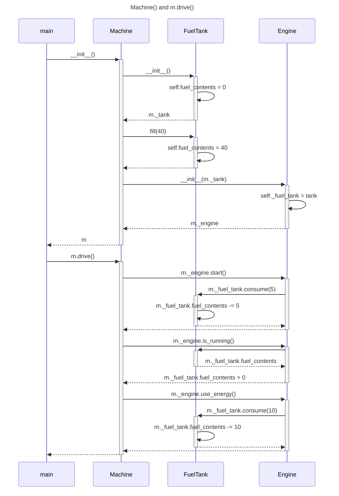

```mermaid
---
title: Machine() and m.drive()
---

sequenceDiagram
    main->>+Machine: __init__()
    Machine->>+FuelTank: __init__()
    FuelTank->>FuelTank: self.fuel_contents = 0
    FuelTank-->>-Machine: m._tank
    Machine->>+FuelTank: fill(40)
    FuelTank->>FuelTank: self.fuel_contents = 40
    FuelTank-->>-Machine: 
    Machine->>+Engine: __init__(m._tank)
    Engine->>Engine: self._fuel_tank = tank
    Engine-->>-Machine: m._engine
    Machine-->>-main: m
    main->>+Machine: m.drive()
    Machine->>+Engine: m._engine.start()
    Engine->>+FuelTank: m._fuel_tank.consume(5)
    FuelTank->>FuelTank: m._fuel_tank.fuel_contents -= 5
    FuelTank-->>-Engine: 
    Engine-->>-Machine: 
    Machine->>+Engine: m._engine.is_running()
    Engine->>+FuelTank: 
    FuelTank-->>-Engine: m._fuel_tank.fuel_contents
    Engine-->>-Machine: m._fuel_tank.fuel_contents > 0
    Machine->>+Engine: m._engine.use_energy()
    Engine->>+FuelTank: m._fuel_tank.consume(10)
    FuelTank->>FuelTank: m._fuel_tank.fuel_contents -= 10
    FuelTank-->>-Engine: 
    Engine-->>-Machine: 
    Machine-->>-main: 
```
