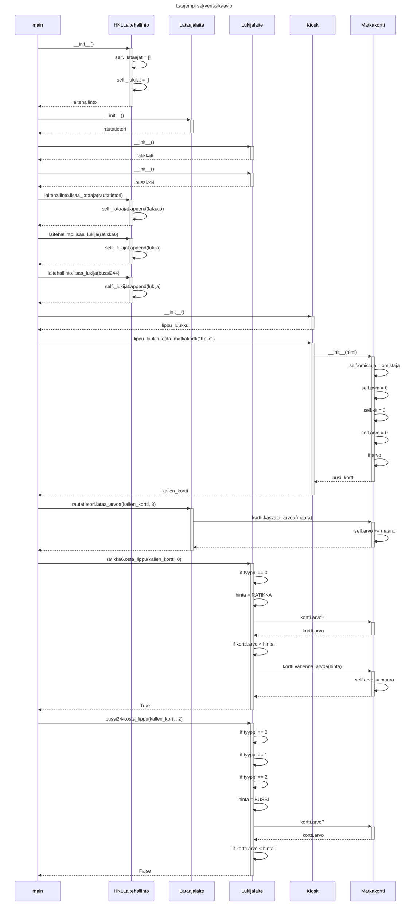

# Disclaimer

En ole varmaa, olisiko pitanyt metodi kutsujen argumentit korvata oikeanlaisilla arvoilla (?)

```mermaid
---
title: Laajempi sekvenssikaavio
---

sequenceDiagram
    main->>+HKLLaitehallinto: __init__()
    HKLLaitehallinto->>HKLLaitehallinto: self._lataajat = []
    HKLLaitehallinto->>HKLLaitehallinto: self._lukijat = []
    

    HKLLaitehallinto-->>-main: laitehallinto
    
    main->>+Lataajalaite: __init__()
    Lataajalaite-->>-main: rautatietori

    main->>+Lukijalaite: __init__()
    Lukijalaite-->>-main: ratikka6

    main->>+Lukijalaite: __init__()
    Lukijalaite-->>-main: bussi244

    main->>+HKLLaitehallinto: laitehallinto.lisaa_lataaja(rautatietori)
    HKLLaitehallinto->>HKLLaitehallinto: self._lataajat.append(lataaja)
    HKLLaitehallinto-->>-main: 

    main->>+HKLLaitehallinto: laitehallinto.lisaa_lukija(ratikka6)
    HKLLaitehallinto->>HKLLaitehallinto: self._lukijat.append(lukija)
    HKLLaitehallinto-->>-main: 
    
    main->>+HKLLaitehallinto: laitehallinto.lisaa_lukija(bussi244)
    HKLLaitehallinto->>HKLLaitehallinto: self._lukijat.append(lukija)
    HKLLaitehallinto-->>-main: 

    main->>+Kiosk: __init__()
    Kiosk-->>-main: lippu_luukku

    
    main->>+Kiosk: lippu_luukku.osta_matkakortti("Kalle")
    Kiosk->>+Matkakortti: __init__(nimi)
    Matkakortti->>Matkakortti: self.omistaja = omistaja
    Matkakortti->>Matkakortti: self.pvm = 0
    Matkakortti->>Matkakortti: self.kk = 0
    Matkakortti->>Matkakortti: self.arvo = 0
    Matkakortti->>Matkakortti: if arvo

    Matkakortti-->>-Kiosk: uusi_kortti
    Kiosk-->>-main: kallen_kortti

    
    main->>+Lataajalaite: rautatietori.lataa_arvoa(kallen_kortti, 3)
    Lataajalaite->>+Matkakortti: kortti.kasvata_arvoa(maara)
    Matkakortti->>Matkakortti: self.arvo += maara
    Matkakortti-->>-Lataajalaite: 
    Lataajalaite-->>-main: 

    main->>+Lukijalaite: ratikka6.osta_lippu(kallen_kortti, 0)
    Lukijalaite->>Lukijalaite: if tyyppi == 0
    Lukijalaite->>Lukijalaite: hinta = RATIKKA
    Lukijalaite->>+Matkakortti: kortti.arvo?
    Matkakortti-->>-Lukijalaite: kortti.arvo
    Lukijalaite->>Lukijalaite: if kortti.arvo < hinta:
    Lukijalaite->>+Matkakortti: kortti.vahenna_arvoa(hinta)
    Matkakortti->>Matkakortti: self.arvo -= maara
    Matkakortti-->>-Lukijalaite: 
    Lukijalaite-->>-main: True

    main->>+Lukijalaite: bussi244.osta_lippu(kallen_kortti, 2)
    Lukijalaite->>Lukijalaite: if tyyppi == 0
    Lukijalaite->>Lukijalaite: if tyyppi == 1
    Lukijalaite->>Lukijalaite: if tyyppi == 2
    Lukijalaite->>Lukijalaite: hinta = BUSSI
    Lukijalaite->>+Matkakortti: kortti.arvo?
    Matkakortti-->>-Lukijalaite: kortti.arvo
    Lukijalaite->>Lukijalaite: if kortti.arvo < hinta:
    Lukijalaite-->>-main: False

```
